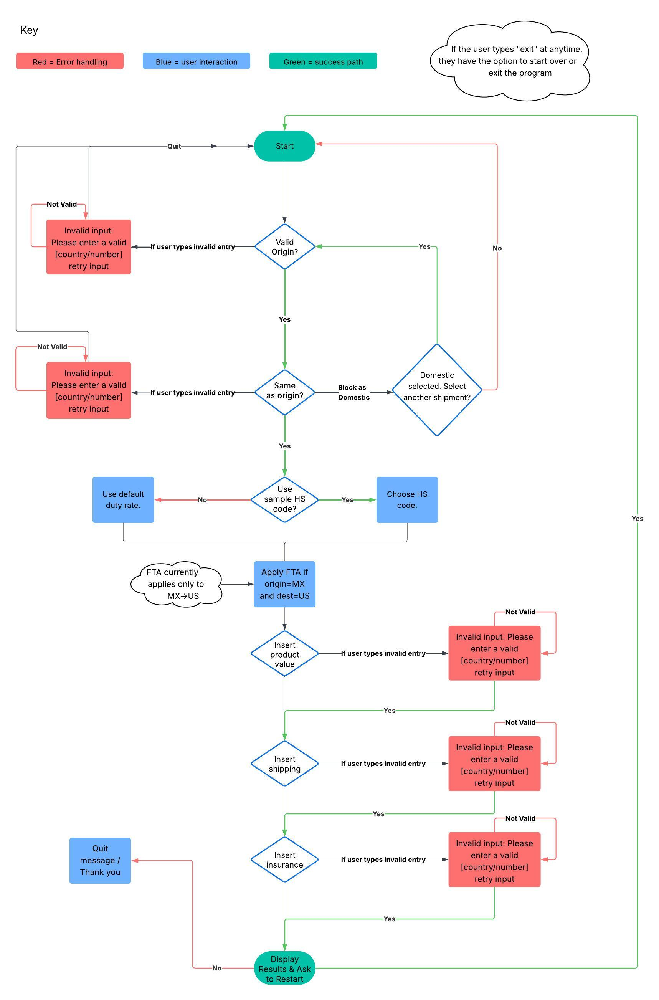

# 📦 Import Duty Calculator

[Live Site on Heroku](https://project-3-0d23a0350b7d.herokuapp.com/)  
This project was built with Python3 as the **"Python's Essentials" Project (Portfolio Project 3)** for [Code Institute](https://codeinstitute.net/).


---

## 📖 Table of Contents
- [Overview](#overview)
- [User Story](#user-story)
- [Planning](#planning)
- [UX](#ux)
- [Design](#design)
- [Features](#features)
- [Research](#research)
- [Duty & Fee Terminology](#-duty--fee-terminology)
- [Calculator Math](#calculator-math)
- [Disclaimer](#disclaimer)
- [Demo Limitations](#demo-limitations)
- [Testing](#testing)
- [Debugging](#debugging)
- [Deployment](#deployment)
- [Credits](#credits)

---

## 🧭 Overview

Calculating import duty, tax, and tariff fees is often more frustrating than it should be. Rates change based on trade policies, political events, and new legislation. Data may be outdated, hard to find, or the existing calculators overly complex.

That’s why I built the **Import Duty Calculator** — a user-friendly terminal app that pulls dynamic values from **Google Sheets** so rates can be updated easily without modifying code. It’s designed to be:

- **Helpful**: Explains results clearly
- **Accessible**: No need for users to understand complex formulas
- **Up-to-date**: Powered by live spreadsheet data

---

## 👤 User Story

 *Picture this: You're running a U.S.-based business that imports LED displays from China. While watching the news, you hear the President announce new tariffs on electronics from several countries. You panic — how much more will your next shipment cost? How do you plan, budget, or quote customers confidently?*  
 
 **This calculator steps in to provide clarity**. With just a few prompts, it calculates your total landed cost, including CIF, Duty, MPF, HMF, and VAT — and even flags whether a Free Trade Agreement might reduce your fees.

---

## 🔀 Planning

The logic of this program is summarized in the following diagram(created with [lucid.app](https://lucid.app/)):



---

## 🧑‍💻 UX

### 🎯 Project Goals  
The goal of this project is to provide users with a simple, accessible, and intuitive calculator for estimating import duties, taxes, and tariffs for shipments entering the U.S. from other countries. It was created with real-world frustrations in mind: changing tariffs, hard-to-navigate government resources, and tools that are not beginner-friendly.  

This tool empowers small businesses, hobby importers, and curious learners with quick estimates based on easily updatable Google Sheet data—no spreadsheets, no manual math, no confusion.

---

## 🎨 Design

Since this project runs entirely in the terminal, there were a few natural limitations when it came to user interface design. But I still wanted to make it feel friendly, clear, and engaging.

One of the ways I brought the calculator to life was by using **emojis** and simple iconography throughout the user flow. These serve both a visual and functional purpose which helps users quickly understand what kind of input is being requested or what kind of result they’re looking at.

For example:
- `🏁` marks the origin country input  
- `🎯` is for the destination  
- `💰`, `🚢`, and `🛡️` clearly flag financial inputs  
- `📦`, `⚓`, and `🧾` are used for specific cost categories  
- `✅`, `⚠️`, and `👋` help punctuate key moments in the experience

This style helps simulate the structure and visual guidance of a graphical UI — even though it's a command-line app — and keeps things feeling lightweight and intuitive.


### 💡 Benefits of the Design

Even without a graphical interface, this calculator is designed to be:
- **Approachable** – thanks to the tone and use of icons
- **Structured** – inputs and outputs are clearly grouped
- **Readable** – spacing and separators (like `"------"`) keep sections clear
- **Consistent** – users learn the rhythm of interaction quickly


### ⚠️ Design Limitations

Of course, working in a terminal comes with some constraints:
- No use of colors or font styling (unless extended by libraries)
- No visual charts or summaries
- No real-time visual interactivity

But given those limits, this project uses what’s available in creative ways to ensure users aren’t just able to complete their calculation — they actually enjoy the process.

---


### 👤 User Stories

#### As a user, I want to:

- Understand what this calculator does as soon as I launch it  
- Select an origin and destination country easily using country codes  
- Be informed if I enter an invalid country code or same origin/destination  
- Enter product value, shipping, and insurance cost with helpful prompts  
- Understand how the final landed cost is calculated  
- See a detailed breakdown of all fees (CIF, duty, MPF, HMF, VAT)  
- Choose a sample HS code if I don’t know the exact one  
- See when an FTA applies and how it affects my duty rate  
- Have the option to calculate a new shipment when I finish  
- Exit the calculator anytime by typing 'exit'  


#### As an admin, I want to:

- Easily update country rates and HS codes without editing the Python code  
- Store all fee configurations in a Google Sheet  
- Maintain the tool’s accuracy over time by adjusting source data  
- Use this project as a testbed for future features like real-time API data or multi-currency support  

---

## 📋 Research

To bring this idea to life, I first needed to untangle the complexities behind import fees and duty tax formulas. That meant diving deep into the planning and research phase with starting with decoding industry terms. Understanding how the fees are structured, and figuring out what goes into calculating total landed cost was essential. Thankfully, tools like Perplexity made the process much smoother, helping me uncover accurate and relevant sources quickly. Armed with those insights, I compiled the core formulas and logic used in this calculator from the following references:

[U.S. Customs and Border Protection](https://www.cbp.gov/trade/basic-import-export/importer-exporter-tips)

[HTS.USITC.gov](https://hts.usitc.gov/)

---

## 🧾 Duty & Fee Terminology

Below are the key terms used throughout this calculator. These are commonly associated with international import costs and help determine the **total landed cost** of goods.

| Term               | Meaning                                                                 |
|--------------------|-------------------------------------------------------------------------|
| **Import Duty**     | A tax charged by the destination country on imported goods. Calculated as a percentage of the item's value (or CIF). Reference: [Investopedia - Import Duty](https://www.investopedia.com/terms/i/import-duty.asp) & [DHL – Import Duty Explained](https://www.dhl.com/discover/en-global/logistics-advice/import-export-advice/what-is-import-duty)|
| **VAT / GST**       | Value Added Tax or Goods and Services Tax. A consumption tax added in many countries, including the EU. Reference: [EasyParcel – What are VAT and GST?](https://helpcentre-my.easyparcel.com/support/solutions/articles/9000224157-what-are-vat-tax-and-gst-tax-)|
| **Other Taxes**     | This can include excise duties, environmental fees, or other local taxes. *(Not calculated in this demo.)* |
| **MPF / HMF**       | U.S.-specific fees: **MPF** (Merchandise Processing Fee) and **HMF** (Harbor Maintenance Fee). Charged based on CIF value. Reference: [Freight Right – What are HMF and MPF?](https://www.freightright.com/kb/hmf-and-mpf)|
| **FTA Reduction**   | A discount or full waiver on import duty if a **Free Trade Agreement** exists between the origin and destination. Reference: [Investopedia – Import Duty (FTA explanation)](https://www.investopedia.com/terms/i/import-duty.asp)|
| **Total Landed Cost** | The final price to import goods: includes product value, duty, VAT, MPF/HMF, insurance, and shipping. Reference: [DHL – Import Duty Explained](https://www.dhl.com/discover/en-global/logistics-advice/import-export-advice/what-is-import-duty)|


- Official links to additional sources: [U.S. Customs and Border Protection](https://www.cbp.gov/trade/basic-import-export/importer-exporter-tips) and [HTS.USITC.gov](https://hts.usitc.gov) for authoritative import fees and regulations. 

---

## 🧮 Calculator Math

The calculator uses the following key formulas:

| Calculation       | Formula |
|------------------|---------|
| **CIF (Cost, Insurance, Freight)** | `CIF = product value + shipping cost + insurance` |
| **Import Duty**   | `Import Duty = CIF × duty_rate` |
| **MPF (Merchandise Processing Fee)** | `MPF = max(min(CIF × mpf_rate, mpf_max), mpf_min)` |
| **HMF (Harbor Maintenance Fee)** | `HMF = CIF × harbor_fee` |
| **VAT**           | `VAT = (CIF + Import Duty + MPF + HMF) × vat_rate` |
| **Total Landed Cost** | `Landed Cost = CIF + Import Duty + MPF + HMF + VAT` |


---

## ⚠️ Disclaimer

This calculator is a **demo/prototype** and is intended for **testing purposes only**. Therefore the rates may not be current.  
- Duty rates, VAT, MPF, and HMF values are not guaranteed to be up-to-date.
- Data is manually managed via Google Sheets and may not reflect current U.S. Customs or international rates.
- Links to official sources: [U.S. Customs and Border Protection](https://www.cbp.gov/trade/basic-import-export/importer-exporter-tips) and [HTS.USITC.gov](https://hts.usitc.gov) for authoritative import fees and regulations.


### ℹ️ Assumptions

- This calculator uses **flat percentage rates** for import duty, VAT, MPF, and HMF.
- It assumes **CIF valuation method** (Cost + Insurance + Freight).
- HS code overrides and FTA eligibility logic are simplified and only apply to specific hard-coded conditions.
- The Merchandise Processing Fee (MPF) uses a capped min/max formula.


### ⚙️ How Rates Are Applied

| Component | Trigger Logic |
|----------|----------------|
| **FTA (Free Trade Agreement)** | If origin is `MX` and destination is `US`, and `fta_eligible` is `TRUE`, then duty rate is set to `0.0`. |
| **HS Code Override** | If user opts to select an HS code, its duty rate overrides the default country rate. |
| **VAT** | Applied to the total value `(CIF + Duty + MPF + HMF) × VAT Rate`, if a non-zero VAT rate exists. |
| **MPF** | Applies to all U.S. imports using `min(max(CIF × rate, min), max)` formula. |
| **HMF** | Only applied if destination country includes a non-zero `harbor_fee` in the data sheet. |


## ❗ Demo Limitations

This calculator is currently a **simplified proof-of-concept** and includes the following known limitations:

- ✅ Only **3 countries** supported: United States (US), Germany (DE), and Mexico (MX).
- ✅ Only **3 sample HS codes** are available for duty overrides.
- ❌ Does not support tiered or compound duty logic (e.g. per-item fees).
- ❌ No currency conversion — all values are assumed to be in USD.
- ❌ Does not distinguish between product categories (e.g. apparel vs. electronics) beyond the provided samples.
- ❌ Does not check whether HMF or VAT applies based on product type or transport mode.
- ⚠️ FTA logic is hardcoded only for **MX → US** scenario.


---

## 📊 Sample Data

This calculator pulls its rates dynamically from an external [Google Sheet](https://docs.google.com/spreadsheets/d/1fKBxT4pJ79_vV1g2D00qnVRt39NgiDhrEzw0EjH4uoM/edit?usp=sharing) to allow easy updating of duty, tax, and fee values without modifying the source code.

The demo version uses a simplified dataset containing three countries and three HS (Harmonized System) product codes.

---

### 🌎 Sample Country Codes

Each country entry includes fields for value-added tax (VAT), merchandise processing fee (MPF), harbor maintenance fee (HMF), currency, and whether the country qualifies for free trade agreement (FTA) exemptions.

| Country Code | VAT Rate | MPF %    | MPF Min | MPF Max | Harbor Fee | Currency | Duty Rate | FTA Eligible |
|--------------|----------|----------|---------|---------|------------|----------|-----------|--------------|
| US           | 0        | 0.00346  | 31.67   | 614.35  | 0.00125     | USD      | 0.08      | TRUE         |
| DE           | 0.19     | 0        | 0       | 0       | 0           | EUR      | 0.04      | TRUE         |
| MX           | 0.16     | 0        | 0       | 0       | 0           | MXN      | 0.08      | TRUE         |


### 📦 Sample Products (HS Codes)

This table contains mock Harmonized System codes (HS codes) used to simulate how duty rates change by product category.

| HS Code      | Description         | Duty Rate |
|--------------|---------------------|------------|
| 4202.31.6000 | Leather Wallets     | 0.08       |
| 6109.10.0012 | Cotton T-Shirts     | 0.165      |
| 8528.72.6400 | LED Displays        | 0.026      |


---

## 🧩 Features

### ✅ Core Functionality
- User selects **origin and destination country codes**
- Prompts for product value, shipping, insurance
- Calculates:
  - CIF
  - Import Duty
  - MPF (with min/max bounds)
  - HMF
  - VAT
  - Total Landed Cost
- Optionally overrides the duty rate using an **HS code**
- Checks for **FTA exemptions** (e.g., Mexico → US)

### 📊 Google Sheets Integration
- Imports `duty_rate`, `mpf_min`, `vat_rate`, etc. from a live Google Sheet
- Easily updated by non-technical users

---

## 📦 Example Output

### Intro Screen


### Begins Prompting User for Data


### Computing Total Landed Cost for USer


### Error Handing: If user inputs random characters


### Option Quit: If user types "exit" at anytime 


---

## 🧪 Testing

### ✅ Validator Testing

To ensure that the code meets Python best practices and standards, I used the [PEP8](https://pep8ci.herokuapp.com) style guide validator.

- **All code successfully passed PEP8 validation.**  
- No warnings or errors remain.

However, during testing, I discovered a few issues that I addressed:

#### Common Issues Found:
- ⚠️ **Long Lines**: Several lines exceeded the recommended 79 characters.  
  **Solution**: I refactored and broke these lines using backslashes (`\`) or by reformatting the structure for better readability.
  
- ⚠️ **Spacing Issues**: There were some unnecessary spaces around operators and after commas.  
  **Solution**: I cleaned up these formatting issues across all affected lines to improve clarity and follow the PEP8 standard.

Thanks to this testing process, the code is now cleaner, more readable, and consistent with Python conventions. This not only helps the current calculator run smoothly but also makes future updates easier to manage. ✅

**Results for my run.py file**


**Results for my duty_calculator.py file**


**Results for my imports_rates.py file**


---

## ✅ Testing User Stories (Functionality)

| **Expectation (As a user, I want to...)**                             | **Result (So I...)**                                               |
|----------------------------------------------------------------------|----------------------------------------------------------------------|
| understand what the calculator does                                  | see an intro message explaining it’s for U.S. imports               |
| exit the calculator anytime                                          | can type `"exit"` at any prompt to leave                           |
| view supported country codes                                         | see a list of valid country codes                                   |
| be warned if I enter an invalid country                              | receive an error and can try again                                  |
| not use the same country for origin and destination                  | get a warning that international routes only are supported          |
| apply a sample HS code if I want                                     | get the option to override with a listed sample HS code             |
| view sample HS codes                                                 | see a numbered list of codes, descriptions, and rates               |
| be warned for invalid HS code selection                              | see an error and calculator defaults to standard duty rate          |
| skip the HS override                                                 | can continue with the default duty rate                             |
| input product value, shipping, and insurance separately              | get prompted step-by-step                                           |
| be warned for invalid or negative values                             | receive a clear error and retry option                              |
| see a detailed breakdown of costs                                    | get line-by-line summary for CIF, duty, fees, and VAT               |
| enjoy a clear and friendly experience                                | see emojis and clear formatting at each step                        |


## 🐞 Debugging

### Fixed Bugs

#### Bug 1: 
`get_positive_float()` was always asking twice
Early in development, the input helper `get_positive_float()` was mistakenly calling `input(prompt)` **twice** — once before the `try` block and again inside it. This resulted in the user needing to enter the value twice for it to be processed correctly.

**How I discovered it:**  
I noticed that I was prompted twice for each number entry. It felt odd and repetitive, so I asked for help.

**Solution:**  
I realized the line `value = float(input(prompt))` was unnecessary because `input(prompt)` had already been called just before. I refactored the code to only prompt the user once.

---

####  Bug 2:
No proper exit for numeric prompts
The calculator didn’t recognize `"exit"` when typed into a number field (like product value or shipping). Instead, it threw a `ValueError` since it tried to convert `"exit"` to a float.

**How I fixed it:**  
I added a conditional to check if the input was `"exit"` before attempting to convert it, and if so, return `None` and exit the calculator.

```python
user_input = input(prompt)
if user_input.lower() == 'exit':
    print("\n👋 Exiting calculator. Goodbye!")
    return None
```
---
#### Bug 3:
HS Code Selection Crash (Index Error)

**Problem:**
When users selected an HS code by typing `1`, the program crashed with:

`IndexError: list index out of range`

**Cause:**  
Python lists start at index `0`, but the interface presented HS code options starting from `1` to feel more intuitive to users.  
This mismatch caused the code to attempt accessing `hs_codes[1]`, which actually pointed to the **second** item — not the first.  
If the list had only one item, this would result in an immediate `IndexError`.

---

**🔍 Investigation Process:**  
To understand the issue, I added debug statements to log the user's selection and the list size:

```
python
print(f"User selected index: {selected_index}")
print(f"Length of hs_codes list: {len(hs_codes)}")

```

When I entered 1, the output was:
```
User selected index: 1
Length of hs_codes list: 3
```

This confirmed the mismatch as the user was selecting a 1-based number, but Python needed 0-based indexing.

**The solution:**
I updated the code to subtract 1 from the input before accessing the list:

```selected_hs = hs_codes[selected_index - 1]```
This made the selection logic match user expectations and eliminated the crash.


## 🚀 Deployment

This calculator was deployed on **Heroku** using the [Code Institute Python Essentials template](https://github.com/Code-Institute-Org/python-essentials-template). The process is beginner-friendly and integrates well with GitHub.

### 🌐 Steps to Deploy:

1. **Forked or clone** this GitHub repository to my own account.

2. Headed to [Heroku](https://www.heroku.com/) and **created an account**.

3. In the Heroku dashboard, clicked **“New” > “Create new app”** and selected a project name.

4. Under the **Settings** tab the new app, scrolled down to **Buildpacks** and added the following **two buildpacks**:
    - `Python`
    - `NodeJS`

    > ⚠️ Made sure `Python` is listed **above** `NodeJS` — the order matters!

5. In the **Deploy** tab:
    - Connected my **GitHub** account and searched for my repository.
    - I enabled the **Automatic Deploys** option as it's recommended.
    - Clicked **“Deploy Branch”** to start the deployment.

6. Once deployed, you I click **“Open App”** to launch my live Import Duty Calculator.


💡 _Note: This project uses a simple terminal-based UI powered by `python-essentials-template`, which handles input/output through Heroku's mock terminal window.

---
## 🙌 Credits


### My Mentor: Spencer Barriball
---

### Tools

[Perplexity as a research tool](https://www.perplexity.ai/)

[ChatGPT for the layout help and emjoi ideas](https://chatgpt.com/)

[PEP8 for code checking](https://pep8ci.herokuapp.com)

---

### Calculator Formulas:

#### Official sources
[U.S. Customs and Border Protection](https://www.cbp.gov/trade/basic-import-export/importer-exporter-tips) [HTS.USITC.gov](https://hts.usitc.gov)


---
### For Duty Terminology

#### Import Duty
[Investopedia - Import Duty](https://www.investopedia.com/terms/i/import-duty.asp)

[DHL – Import Duty Explained](https://www.dhl.com/discover/en-global/logistics-advice/import-export-advice/what-is-import-duty)

#### VAT/GST
[EasyParcel – What are VAT and GST?](https://helpcentre-my.easyparcel.com/support/solutions/articles/9000224157-what-are-vat-tax-and-gst-tax-)

#### MPF/HMF
[Freight Right – What are HMF and MPF?](https://www.freightright.com/kb/hmf-and-mpf)

#### FTA
[Investopedia – Import Duty (FTA explanation)](https://www.investopedia.com/terms/i/import-duty.asp)

#### Total Land Cost
[DHL – Import Duty Explained](https://www.dhl.com/discover/en-global/logistics-advice/import-export-advice/what-is-import-duty)